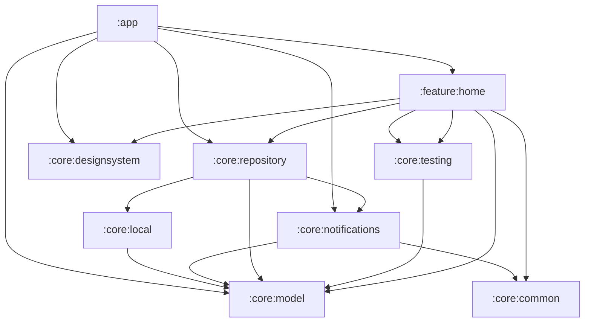

# todo-sample-app
This is a TODO app with categories to introduce technologies I am willing to try.
## How to install

### Prerequisite
- Android Studio Hedgehog
- Android SDK Build-Tools 34
- JDK 20.0.2

### Clone this repository
First, clone this repository to a local directory using the following command.

```bash
git clone https://github.com/dao0203/todo-sample-app.git
```

### Installing Dependencies
Open Android Studio and select `File` > `Open` to open the cloned project folder. 
Once the project is open, the IDE will automatically start resolving dependencies. 
If you encounter any problems, rebuild the project by selecting `Build` > `Rebuild Project`.

### Running an app
Set up the emulator or connect your Android device to your PC and run the application by selecting `Run` > `Run 'app'`.

The application should now run successfully on the device or emulator. If there are any problems, check that the project settings and dependencies are configured correctly.

## Technology Stack
The following technologies, libraries nad tools are used in this project.

### Application Framework

- **Android SDK**: used to build the basic functionality and interface of your app.
- **Kotlin**: The main programming language for Android app development.
- **Jetpack Compose**: A declarative UI framework for building modern UIs.

### Architecture

- **Layered Architecture**: We adopt the architectural pattern recommended by the official Android documentation to enhance the separation of UI and business logic and improve testability and maintainability.
- **Clean Architecture**: adopts an architecture that clearly separates the responsibilities of each layer to increase the testability and scalability of the application.
- **Repository Pattern**: An abstract layer between the data source and business logic layers hides the details of data retrieval and manipulation. This makes it easy to make changes to the data source without affecting the rest of the application.

Here's the dependency graph of this repository.


### Multi Module
This project employs **multi module**, splitting modules by function to increase code reusability and reduce build time.

### Composite Build
It uses Gradle's ability to integrate and build multiple projects. This facilitates dependency management between libraries and modules and makes the development process more flexible.
 
### Data Management

- **Room**: provides an abstract layer of SQLite to facilitate full-scale database operations.

### Asynchronous Processing

- **Coroutine**: Kotlin's lightweight asynchronous programming model. Simplifies the management and execution of asynchronous tasks.
- **Flow**: a reactive programming approach for handling asynchronous data streams using Kotlin Coroutines. It can monitor data changes and dynamically update the UI accordingly.

### Dependency Injection

- **Dagger-Hilt**: Library for injecting and managing dependencies across application tiers.

### Build Tools

- **Gradle**: Tool to automate project build and dependency management.

### VRT Tools

- reg-suit: Automates vrt by comparing screenshots before and after changes.
- roborazzi: Allows you to take screenshots on the JVM and automate vrt.

### CI

- GitHub Actions: Automate wrokflow, this repository contains workflows to automate vrt.


